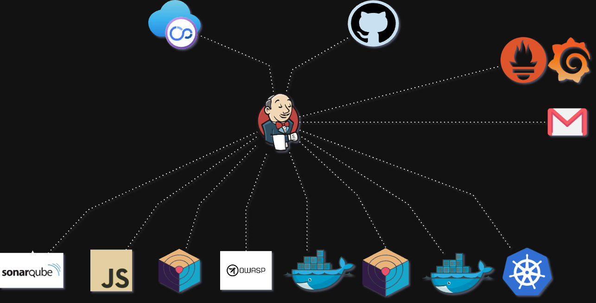

# NetflixOps




## Overview
This repo contains the code & steps followed to deploy a Netflix clone app using Jenkins CI-CD, Docker container with Kubernetes Cluster along with the monitoring of metric using Grafana, Prometheus & Node Exporter.

## Details steps

### Launching a T2 instance
- Choose any t2 instance 
For the project I am going to use https://www.localstack.cloud/ which is used to test AWS apps locally.

- Follow the follwing steps for localstack
```
brew install localstack/tap/localstack-cli
```

Verifiy installation
```
localstack --version
```
-- 3.5.0

#### Using Docker to start LocalStack ec2 instance using docker-compose.yml in /docker  
```
docker-compose up
```
- LocalStack Endpoint 
```
aws --endpoint-url=http://localhost:4566 ec2 run-instances \
    --profile localstack \
    --image-id ami-df5de72bdb3b \
    --instance-type t2.micro \
    --tag-specifications 'ResourceType=instance,Tags=[{Key=Name,Value=MyInstance}]'
```
- Access Logs
```
localstack logs
```
#### MISC
- Describe instance
```
aws --endpoint-url=http://localhost:4566 ec2 describe-instances --profile localstack
```
- Stop Instance
```
aws --endpoint-url=http://localhost:4566 ec2 stop-instances --instance-ids <Instance-id> --profile localstack
```
- Start Instance 
```

aws --endpoint-url=http://localhost:4566 ec2 start-instances --instance-ids <Instance-id> --profile localstack
```

## Install Jenkins

run jenkins.sh inside the scripts to install jenkins for pipelines.
```sh
chmod +x jenkins.sh
./jenkins.sh
```
## Installing SonarQube container

>**Note**: Make sure you have docker installed 
```sh 
docker run -d --name sonar -p 9000:9000 sonarqube:lts-community
```
## Install Trivy
Find the script inside the scripts dir.

```sh 

chmod +x install_trivy.sh
./install_trivy.sh

```


## Create a TMDB API Key for movie database

[TMDB Website](https://www.themoviedb.org/)

>**IMP**: You will need vpn if you're browsing from India


## Installing Prometheus and Grafana
